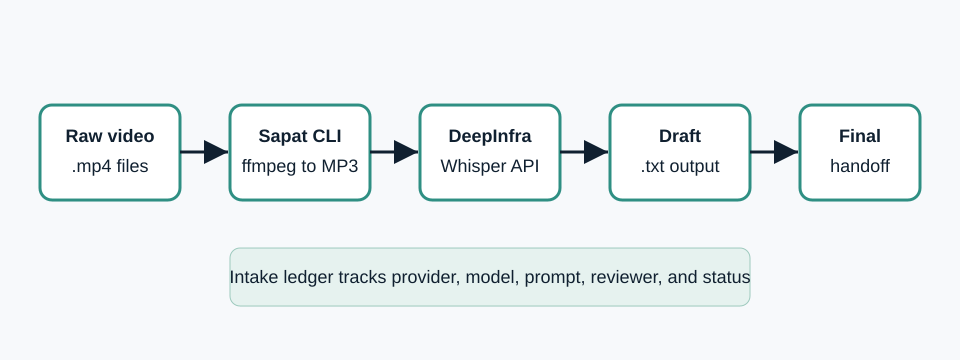

# Run Sapat with DeepInfra in Daytona

# Introduction

Most transcription workflows start clean and become messy after the first real
recording. A developer records a sprint review, customer call, product demo, or
research interview, runs a transcription command, and gets one text file back.
That works once. It breaks down when you need to repeat the run, explain which
provider was used, compare prompt choices, review the transcript, and hand off
the final artifact to another engineer.

This guide shows how to run
[Sapat](https://github.com/nibzard/sapat), a Python video transcription CLI,
inside a [Daytona workspace](../definitions/20240819_definition_daytona%20workspace.md)
with DeepInfra as the speech-to-text provider. You will build a small
[transcript intake pipeline](../definitions/20260520_definition_transcript_intake_pipeline.md)
that keeps raw recordings, transcription settings, review notes, and final
transcripts together.

The companion Sapat contribution adds a `--api deepinfra` option using
DeepInfra's OpenAI-compatible audio transcription endpoint:
[nibzard/sapat#20](https://github.com/nibzard/sapat/pull/20).

## TL;DR

- Use Daytona to keep Sapat, ffmpeg, and provider credentials in one
  reproducible workspace.
- Use DeepInfra's `/v1/audio/transcriptions` endpoint through Sapat's
  `--api deepinfra` option.
- Keep a lightweight intake ledger so every transcript has its source file,
  provider, model, prompt, reviewer, and final status.
- Treat the `.txt` transcript as a draft until a human review pass confirms
  names, terms, omissions, and downstream use.

## Prerequisites

Before starting, make sure you have:

- A working Daytona installation and a configured Git provider.
- Python 3.10 or newer in the workspace.
- `ffmpeg`, because Sapat converts video input to MP3 before transcription.
- A DeepInfra account token stored outside Git.
- A short `.mp4` sample recording for the first smoke test.

DeepInfra documents its audio transcription endpoint as
`https://api.deepinfra.com/v1/audio/transcriptions`. The request uses
multipart form data with a required `file`, a required `model`, and optional
fields such as `language`, `prompt`, `response_format`, and `temperature`.

## Step 1: Create the Daytona workspace

Create a Daytona workspace from the Sapat fork that contains the DeepInfra
provider branch. After the Sapat PR is merged, you can use the upstream Sapat
repository directly.

```bash
daytona create https://github.com/anamanlab/sapat --code
```

Open the workspace terminal and move to the repository:

```bash
cd sapat
git checkout add-deepinfra-provider
```

Install the package in editable mode:

```bash
python -m pip install --upgrade pip
python -m pip install -e .
```

Confirm that the CLI sees the new provider:

```bash
sapat --help
```

You should see `deepinfra` listed beside `openai`, `groq`, and `azure` in the
`--api` option.

## Step 2: Configure DeepInfra without committing secrets

Create a local `.env` file. Do not commit it. Sapat loads environment variables
from `.env`, so the token and model settings stay outside the article, the
repository, and future pull requests.

```bash
cat > .env <<'EOF'
DEEPINFRA_TOKEN=YOUR_DEEPINFRA_TOKEN
DEEPINFRA_MODEL=openai/whisper-large
DEEPINFRA_API_ENDPOINT=https://api.deepinfra.com/v1/audio/transcriptions
EOF
```

The default model in the companion provider is `openai/whisper-large`.
DeepInfra also documents other Whisper variants, including smaller and
timestamped models. Use the default for the first smoke test, then change the
model only when you have a reason such as speed, cost, or timestamp needs.

If you prefer Daytona environment variables instead of a local `.env` file,
add the same keys in your Daytona workspace configuration and restart the
workspace terminal before running Sapat.

## Step 3: Create the transcript intake folders

A transcript workflow is easier to trust when the filesystem mirrors the
process. Use separate folders for raw recordings, draft transcripts, review
notes, and final handoff files.

```bash
mkdir -p transcript-intake/raw
mkdir -p transcript-intake/drafts
mkdir -p transcript-intake/review
mkdir -p transcript-intake/final
```

Create a simple ledger:

```bash
cat > transcript-intake/intake-ledger.md <<'EOF'
# Transcript Intake Ledger

| ID | Source file | Provider | Model | Prompt | Reviewer | Status |
| --- | --- | --- | --- | --- | --- | --- |
| TI-001 | raw/product-demo.mp4 | deepinfra | openai/whisper-large | product-demo prompt | pending | draft |
EOF
```

The ledger is intentionally plain Markdown. It travels well in Git, pull
requests, issue comments, and team handoffs. Add columns only when they help
someone reproduce or review the transcript.

## Step 4: Add a prompt file for domain terms

Whisper-style transcription can miss names, product terms, acronyms, and
project-specific vocabulary. Sapat supports a `--prompt` argument, so keep a
short prompt with the terms you expect to hear.

```bash
cat > transcript-intake/product-demo-prompt.txt <<'EOF'
Product names and terms: Sapat, Daytona, DeepInfra, transcript intake,
workspace, provider, review ledger.
EOF
```

Keep the prompt factual. Do not use it to summarize the recording in advance.
The goal is to bias spelling and terminology, not to invent content.

## Step 5: Run the first DeepInfra transcription

Copy your sample `.mp4` into the raw folder:

```bash
cp ~/Downloads/product-demo.mp4 transcript-intake/raw/product-demo.mp4
```

Run Sapat with DeepInfra:

```bash
sapat transcript-intake/raw/product-demo.mp4 \
  --quality M \
  --language en \
  --prompt "$(cat transcript-intake/product-demo-prompt.txt)" \
  --temperature 0 \
  --api deepinfra
```

Sapat converts the video to MP3, sends the audio to the selected provider, and
writes a `.txt` file next to the source video. Move that draft into the intake
folder:

```bash
mv transcript-intake/raw/product-demo.txt \
  transcript-intake/drafts/TI-001-product-demo.deepinfra.txt
```

Then update the ledger status from `draft` to `needs review`.

## Step 6: Review the transcript before downstream use

Treat the first transcript as a draft. Even good speech recognition can fail on
overlapping speakers, poor microphones, product names, and accented terms. Add
a review note beside the draft:

```bash
cat > transcript-intake/review/TI-001-review.md <<'EOF'
# TI-001 Review Notes

## Source

- File: raw/product-demo.mp4
- Provider: DeepInfra
- Model: openai/whisper-large
- Prompt: product-demo-prompt.txt

## Review checklist

- [ ] Product names are spelled correctly.
- [ ] Speaker meaning is preserved.
- [ ] Obvious hallucinated phrases are removed.
- [ ] Sensitive or private details are flagged before sharing.
- [ ] Final transcript has a clear downstream owner.

## Corrections

Add manual corrections here before moving the transcript to final.
EOF
```

For engineering teams, the review owner might be the developer who recorded a
bug reproduction. For operations teams, it might be the person who owns the
customer or internal process. Either way, one named reviewer prevents the
transcript from becoming an anonymous artifact.

## Step 7: Promote the reviewed transcript

After review, copy the cleaned transcript to the final folder:

```bash
cp transcript-intake/drafts/TI-001-product-demo.deepinfra.txt \
  transcript-intake/final/TI-001-product-demo.final.txt
```

Update the ledger:

```markdown
| TI-001 | raw/product-demo.mp4 | deepinfra | openai/whisper-large | product-demo prompt | Arthur | final |
```

Now the transcript is ready for its next use, such as:

- turning a product demo into release notes;
- extracting support issues into a ticket queue;
- building a searchable knowledge base;
- preparing a clean summary for a customer success handoff;
- attaching reviewed evidence to a bug report.



## Step 8: Repeat the workflow for a folder

Sapat can process every `.mp4` file in a directory. Use this when you have a
batch of short recordings that share one language and one prompt.

```bash
sapat transcript-intake/raw \
  --quality M \
  --language en \
  --prompt "$(cat transcript-intake/product-demo-prompt.txt)" \
  --temperature 0 \
  --api deepinfra
```

For mixed recordings, do not batch blindly. Separate files by language, subject,
and sensitivity. A single prompt for every recording is convenient, but it is
usually too vague for high-quality review.

## Common issues and troubleshooting

**Problem:** `ffmpeg` is not found.

**Solution:** Install `ffmpeg` in the Daytona workspace or use a dev container
image that already includes it. Sapat calls `ffmpeg` before it sends audio to
the transcription provider.

**Problem:** DeepInfra returns an authentication error.

**Solution:** Confirm that `DEEPINFRA_TOKEN` is present in `.env` or in the
Daytona workspace environment. Restart the terminal after changing environment
variables.

**Problem:** The transcript is empty or too short.

**Solution:** Check the source audio first. Run the command again with
`--quality H` if the audio is quiet, stereo, or difficult to understand. Also
confirm that the source file is a supported video format that `ffmpeg` can
convert.

**Problem:** Important names are misspelled.

**Solution:** Add the names to a short prompt file and rerun the transcription.
Keep prompt files versioned when the transcript will become part of a formal
handoff or review packet.

**Problem:** The transcript is not ready to share.

**Solution:** Keep the file in `drafts` until the review checklist is complete.
The `final` folder should contain only transcripts that someone has reviewed.

## Conclusion

The useful part of this workflow is not only the transcription command. It is
the repeatable path around the command: a Daytona workspace, a provider choice,
a prompt file, a draft transcript, a review note, and a final artifact. That
structure makes Sapat more practical for real engineering work because every
transcript can be traced back to its source and settings.

With the DeepInfra provider branch, Sapat can call DeepInfra's audio
transcription endpoint through `--api deepinfra`. Daytona keeps the run
environment reproducible, while the intake ledger gives teams a small but
durable record of what happened.

## References

- [Sapat repository](https://github.com/nibzard/sapat)
- [DeepInfra audio transcription API](https://docs.deepinfra.com/api-reference/audio/openai-audio-transcriptions)
- [DeepInfra Whisper speech recognition guide](https://docs.deepinfra.com/tutorials/whisper)
- [Daytona documentation](https://www.daytona.io/docs/)
- [Companion Sapat DeepInfra provider PR](https://github.com/nibzard/sapat/pull/20)
